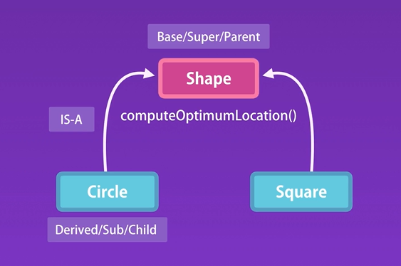
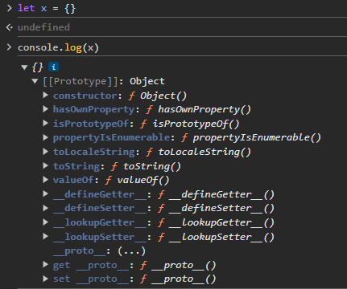
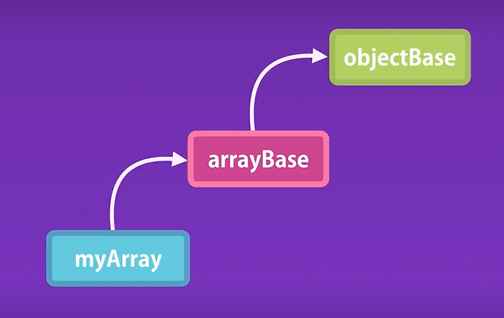

# Prototypes

## Inheritance

Heredar propiedades y métodos de una clase base, super o padre. Los objetos que heredan se llaman objetos derivados, sub o hijos.



## Prototypical Inheritance

Un prototype es un objeto.



Entonces, los objetos heredan del prototipo u objeto "Object" que contiene métodos como "toString()".

```js
let x = {};
x.toString();
```

## Multilevel Inheritance

```js
let myArray = []; // <-- Hereda de Array y a su vez Array hereda de Object

myArray.push(); // Método de Array
myArray.toString(); // Método de Object
```



## Property Descriptors

Evitan que las propiedades sean devueltas por un iterator.

```js
let circle = {
  radius: 10
}

for(key in circle){
  console.log(key); // <-- radius
}

circle.toString(); // <-- Existe pero no la muestra ya que pertenece a otro __proto__ 
```

Se pueden modificar los tipos de acceso a propiedades con "defineProperty"

```js
let person = { name: 'Mosh' };

Object.defineProperty(person, 'name', {
  writable: false, // <-- indica que no se puede modificar
  enumerable: false, // <-- evita que la propiedad se iterable
  configurable: false // <-- evita que la propiedad sea eliminada
});
```

## Constructor Prototype

```js
obj = {};

obj.__proto__ // <-- Object.prototype 
```

```js
function Circle(radius){
  this.radius = radius;
}

circle.__proto__ // <-- Circle.prototype 
```

## Prototype members vs Instance Members

Prototype members: son prototipos almacenados en el objecto padre y son llamados cuando algún hijo lo requiere, de esta forma se evita que el hijo copie el método.

Instance members: son propiedades almacenadas en el mismo objeto por lo que se necesita de una copia en memoria de las mismas.

Por lo tanto, los "prototype members" permiten que no se almacenen copias innecesarias de métodos en la memoria, utilizando la técnica de prototipos para que los objetos hijos accedan en este prototipo el método a utilizar y no tengan una copia del mismo.

```js
function Circle(radius){
  // Instance members
  this.radius = radius; 
}

// Prototype members
Circle.prototype.draw = function(){
  console.log('draw'); 
}

const c1 = new Circle(1);
c1.draw(); // <-- Ok
```

Los prototipos pueden ser llamados dentro del objeto.

```js
function Circle(radius){
  this.move = function(){
    this.draw() // <-- llamada al método draw del prototipo Circle
  }
}
```

Los prototipos pueden llamar a métodos del objeto.

```js
Circle.prototype.draw = function(){
  this.move() // <-- llamada al método move miembro de Circle
  console.log('draw');
}
```

Reescribir prototipos

```js
// Se reescribe un prototipo heredado de Object para darle un comportamiento diferente en Circle
Circle.prototype.toString = function(){
  return "Circle with radius " + this.radius;
}

c1.toString(); // "Circle with radius 1"
```

Iterar "instance members".

```js
const keys = Object.keys(c1); // <-- retorna instance members dentro de un array
```

Iterar "prototype members".

```js
for(let key in c1){
  console.log(key); // instance members y prototype members
}

```
